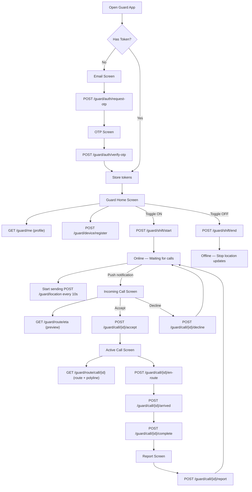

# 🛡️ Guard App — Complete Flutter Integration Guide

> **Base URL**: `https://safe-city-back-7c8ed50edd7d.herokuapp.com/api/v1`  
> **Auth**: All endpoints (except auth) require `Authorization: Bearer <guard_access_token>` header  
> **Note**: Guards are pre-registered by a company admin. They cannot self-register.

---

## App Architecture Overview

```
lib/
├── models/
│   ├── guard.dart
│   ├── emergency_call.dart
│   ├── route_model.dart
│   ├── shift.dart
│   ├── notification.dart
│   └── settings.dart
├── services/
│   ├── guard_auth_service.dart
│   ├── guard_profile_service.dart
│   ├── shift_service.dart
│   ├── call_service.dart
│   ├── route_service.dart
│   ├── location_service.dart
│   └── device_service.dart
├── screens/
│   ├── auth/
│   │   ├── guard_email_screen.dart
│   │   └── guard_otp_screen.dart
│   ├── home/
│   │   └── guard_home_screen.dart       (shift toggle + incoming calls)
│   ├── call/
│   │   ├── incoming_call_screen.dart    (accept/decline with ETA preview)
│   │   ├── active_call_screen.dart      (map + route + status buttons)
│   │   ├── call_chat_screen.dart
│   │   └── call_report_screen.dart
│   ├── history/
│   │   └── call_history_screen.dart
│   ├── profile/
│   │   └── guard_profile_screen.dart
│   └── settings/
│       └── guard_settings_screen.dart
```

---

## Complete Guard Flow



---

## 1. Authentication

> [!IMPORTANT]
> Guards are pre-registered by a company admin (via the admin panel). The guard can only log in if their email exists in the system.

### 1.1 Request OTP

```
POST /guard/auth/request-otp
```

**Request:**
```json
{ "email": "guard@company.com" }
```

**Response (200):**
```json
{
  "success": true,
  "message": "OTP sent successfully",
  "data": { "email": "guard@company.com" }
}
```

**Error (404):** `"Guard not found. Please contact your company admin."`
**Error (403):** `"Guard account is not active"`

### 1.2 Verify OTP → Get Tokens

```
POST /guard/auth/verify-otp
```

**Request:**
```json
{
  "email": "guard@company.com",
  "code": "1234"
}
```

**Response (200):**
```json
{
  "access_token": "eyJhbGciOi...",
  "refresh_token": "eyJhbGciOi...",
  "token_type": "bearer",
  "expires_in": 1800,
  "role": "guard"
}
```

### 1.3 Refresh Token

```
POST /guard/auth/refresh
```

**Request:**
```json
{ "refresh_token": "eyJhbGciOi..." }
```

### Dart Implementation

```dart
// lib/services/guard_auth_service.dart
class GuardAuthService {
  final Dio _dio;
  GuardAuthService(this._dio);

  Future<Map<String, dynamic>> requestOTP(String email) async {
    final resp = await _dio.post('/guard/auth/request-otp', data: {'email': email});
    return resp.data;
  }

  Future<TokenResponse> verifyOTP(String email, String code) async {
    final resp = await _dio.post('/guard/auth/verify-otp', data: {
      'email': email, 'code': code,
    });
    return TokenResponse.fromJson(resp.data);
  }

  Future<TokenResponse> refreshToken(String refreshToken) async {
    final resp = await _dio.post('/guard/auth/refresh', data: {
      'refresh_token': refreshToken,
    });
    return TokenResponse.fromJson(resp.data);
  }
}
```

---

## 2. Guard Profile

### 2.1 Get Profile (with company info)

```
GET /guard/me
```

**Response:**
```json
{
  "id": 5,
  "email": "guard@company.com",
  "phone": "+77009876543",
  "full_name": "Арман Сериков",
  "avatar_url": "https://...",
  "employee_id": "G-042",
  "status": "active",
  "is_online": false,
  "is_on_call": false,
  "rating": 4.8,
  "total_reviews": 127,
  "total_calls": 250,
  "completed_calls": 245,
  "created_at": "2026-01-15T10:00:00Z",
  "company": {
    "id": 1,
    "name": "КүзетPRO",
    "logo_url": "https://...",
    "phone": "+77001234567"
  }
}
```

### 2.2 Update Profile

```
PATCH /guard/me
```

**Request (all optional):**
```json
{
  "full_name": "Арман Сериков",
  "avatar_url": "https://..."
}
```

---

## 3. Shift Management (Online/Offline Toggle)

> [!IMPORTANT]
> The guard MUST start a shift to receive calls. This is the "Active" toggle switch on the home screen.

### 3.1 Start Shift (Go Online)

```
POST /guard/shift/start
```

**Response:**
```json
{
  "id": 100,
  "started_at": "2026-03-30T10:00:00Z",
  "ended_at": null,
  "duration_minutes": null
}
```

**Error (400):** `"Already online"`

### 3.2 End Shift (Go Offline)

```
POST /guard/shift/end
```

**Response:**
```json
{ "success": true, "message": "Shift ended" }
```

**Error (400):** `"Already offline"` or `"Cannot go offline while on a call"`

### 3.3 Get Current Shift Status

```
GET /guard/shift/current
```

**Response:**
```json
{
  "is_online": true,
  "current_shift": {
    "id": 100,
    "started_at": "2026-03-30T10:00:00Z",
    "ended_at": null,
    "duration_minutes": null
  }
}
```

### Dart Implementation

```dart
// lib/services/shift_service.dart
class ShiftService {
  final Dio _dio;
  ShiftService(this._dio);

  Future<ShiftData> startShift() async {
    final resp = await _dio.post('/guard/shift/start');
    return ShiftData.fromJson(resp.data);
  }

  Future<void> endShift() async {
    await _dio.post('/guard/shift/end');
  }

  Future<ShiftStatus> getCurrentStatus() async {
    final resp = await _dio.get('/guard/shift/current');
    return ShiftStatus.fromJson(resp.data);
  }
}
```

---

## 4. Real-time Location Updates

> [!IMPORTANT]
> **This is critical!** While online, the guard app MUST continuously send GPS coordinates. Without this, the dispatch engine cannot find the guard, and routing endpoints will fail.

```
POST /guard/location
```

**Request:**
```json
{ "latitude": 43.235000, "longitude": 76.940000 }
```

**Response:**
```json
{ "success": true, "message": "Location updated" }
```

### Dart Implementation

```dart
// lib/services/location_service.dart
import 'dart:async';
import 'package:geolocator/geolocator.dart';

class GuardLocationService {
  final Dio _dio;
  Timer? _timer;

  GuardLocationService(this._dio);

  /// Call this when shift starts
  void startTracking() {
    _timer = Timer.periodic(const Duration(seconds: 10), (_) async {
      try {
        final pos = await Geolocator.getCurrentPosition(
          desiredAccuracy: LocationAccuracy.high,
        );
        await _dio.post('/guard/location', data: {
          'latitude': pos.latitude,
          'longitude': pos.longitude,
        });
      } catch (e) {
        debugPrint('Location update failed: $e');
      }
    });
  }

  /// Call this when shift ends
  void stopTracking() {
    _timer?.cancel();
    _timer = null;
  }
}
```

> [!TIP]
> Send location every **10 seconds** during an active call (for accurate route updates) and every **30 seconds** while just online/idle. Use `geolocator` package with `LocationAccuracy.high`.

---

## 5. Call Lifecycle — The Core Feature

### 5.1 Get Active Call

```
GET /guard/call/active
```

**Response (200):**
```json
{
  "id": 42,
  "status": "accepted",
  "latitude": 43.240123,
  "longitude": 76.945678,
  "address": "ул. Абая 52",
  "created_at": "2026-03-30T10:00:00Z",
  "accepted_at": "2026-03-30T10:01:00Z",
  "security_company": {
    "id": 1,
    "name": "КүзетPRO"
  }
}
```

**Error (404):** No active call — guard is idle.

### 5.2 Accept Call

```
POST /guard/call/{call_id}/accept
```

**Response:** Returns the updated `EmergencyCall` with status `accepted`.

**Validations:**
- Call must be in `searching` or `offer_sent` status
- Guard must belong to the assigned company

### 5.3 Decline Call (triggers reassignment!)

```
POST /guard/call/{call_id}/decline
```

**Response:**
```json
{ "success": true, "message": "Call declined. Reassigned to Бауыржан Каримов." }
```
or
```json
{ "success": true, "message": "Call declined. No available guards found — call cancelled." }
```

> [!NOTE]
> When a guard declines, the backend automatically finds the next nearest online guard and sends them a notification. The declining guard doesn't need to do anything further.

### 5.4 Status Transitions (Guard controls these)

```
POST /guard/call/{call_id}/en-route     ← "Выехал" button
POST /guard/call/{call_id}/arrived      ← "На месте" button  
POST /guard/call/{call_id}/complete     ← "Завершить" button
```

Each returns the updated `EmergencyCall` object.

**Valid transitions:**
```
accepted → en_route → arrived → completed
```

Any other transition returns `400 Invalid status transition`.

### 5.5 Call History

```
GET /guard/history?limit=20&offset=0&status_filter=completed
```

**Response:**
```json
{
  "calls": [
    {
      "id": 42,
      "status": "completed",
      "created_at": "2026-03-30T10:00:00Z",
      "completed_at": "2026-03-30T10:15:00Z",
      "duration_seconds": 900
    }
  ],
  "total": 245
}
```

### Dart Implementation

```dart
// lib/services/call_service.dart
class GuardCallService {
  final Dio _dio;
  GuardCallService(this._dio);

  Future<EmergencyCall?> getActiveCall() async {
    try {
      final resp = await _dio.get('/guard/call/active');
      return EmergencyCall.fromJson(resp.data);
    } on DioException catch (e) {
      if (e.response?.statusCode == 404) return null;
      rethrow;
    }
  }

  Future<EmergencyCall> acceptCall(int callId) async {
    final resp = await _dio.post('/guard/call/$callId/accept');
    return EmergencyCall.fromJson(resp.data);
  }

  Future<void> declineCall(int callId) async {
    await _dio.post('/guard/call/$callId/decline');
  }

  Future<EmergencyCall> setEnRoute(int callId) async {
    final resp = await _dio.post('/guard/call/$callId/en-route');
    return EmergencyCall.fromJson(resp.data);
  }

  Future<EmergencyCall> setArrived(int callId) async {
    final resp = await _dio.post('/guard/call/$callId/arrived');
    return EmergencyCall.fromJson(resp.data);
  }

  Future<EmergencyCall> completeCall(int callId) async {
    final resp = await _dio.post('/guard/call/$callId/complete');
    return EmergencyCall.fromJson(resp.data);
  }
}
```

---

## 6. Navigation & Routing (Map Screen)

### 6.1 Get Route to Active Call (Primary — use this)

```
GET /guard/route/call/{call_id}?with_steps=false
```

**Response:**
```json
{
  "call_id": 42,
  "call_status": "en_route",
  "user_latitude": 43.240123,
  "user_longitude": 76.945678,
  "user_address": "ул. Абая 52",
  "guard_latitude": 43.235000,
  "guard_longitude": 76.940000,
  "route": {
    "geometry": "e~leFm~idTnA...",
    "coordinates": [[43.235, 76.940], [43.236, 76.941], ...],
    "distance_meters": 2300,
    "duration_seconds": 240,
    "eta_minutes": 4,
    "distance_text": "2.3 км",
    "steps": []
  },
  "guard_name": "Арман Сериков",
  "guard_avatar_url": "https://...",
  "guard_rating": 4.8,
  "guard_total_reviews": 127,
  "guard_phone": "+77009876543"
}
```

> [!IMPORTANT]
> - `coordinates` → use directly as polyline points on `flutter_map`
> - `eta_minutes` → show as the `~4 мин` badge on the map
> - Refresh this every **30 seconds** while the guard is driving
> - Guard MUST have sent at least one location update, otherwise returns `400`

### 6.2 Quick ETA Preview (Before Accepting)

```
GET /guard/route/eta?dest_lat=43.240&dest_lng=76.945
```

**Response:**
```json
{
  "eta_minutes": 4,
  "distance_text": "2.3 км"
}
```

> [!TIP]
> Use this on the **Incoming Call Screen** to show the guard a distance/time preview before they accept or decline.

### 6.3 Standalone Route Calculate

```
POST /guard/route/calculate
```

**Request:**
```json
{
  "origin_lat": 43.235, "origin_lng": 76.940,
  "dest_lat": 43.240,  "dest_lng": 76.945,
  "with_steps": false
}
```

---

## 7. In-Call Chat

### 7.1 Send Message

```
POST /guard/call/{call_id}/message
```

**Request:**
```json
{ "message": "Буду через 3 минуты" }
```

### 7.2 Get Messages

```
GET /guard/call/{call_id}/messages
```

**Response:**
```json
{
  "messages": [
    {
      "id": 1, "call_id": 42,
      "sender_type": "user", "sender_id": 1,
      "message": "Я у второго подъезда",
      "created_at": "2026-03-30T10:05:00Z"
    },
    {
      "id": 2, "call_id": 42,
      "sender_type": "guard", "sender_id": 5,
      "message": "Буду через 3 минуты",
      "created_at": "2026-03-30T10:05:30Z"
    }
  ],
  "total": 2
}
```

---

## 8. Post-Call Report

```
POST /guard/call/{call_id}/report
```

**Request:**
```json
{
  "report_text": "Прибыл на место, конфликт урегулирован. Участники разошлись.",
  "category": "assault"
}
```

**Categories:** `theft`, `assault`, `false_alarm`, `other`

> [!NOTE]
> Reports can only be submitted for `completed` calls. One report per call.

---

## 9. Device Registration (Push Notifications)

### 9.1 Register Device

```
POST /guard/device/register
```

**Request:**
```json
{
  "device_token": "fcm_token_abc123...",
  "device_type": "ios",
  "device_model": "iPhone 15 Pro",
  "app_version": "1.0.0"
}
```

### 9.2 Unregister Device

```
DELETE /guard/device/{token}
```

> [!IMPORTANT]
> Call `register` immediately after login and whenever the FCM token refreshes. Call `unregister` on logout. `device_type` must be exactly `"ios"` or `"android"`.

---

## 10. Guard Settings

### 10.1 Get Settings

```
GET /guard/settings
```

**Response:**
```json
{
  "notifications_enabled": true,
  "call_sound_enabled": true,
  "vibration_enabled": true,
  "language": "ru",
  "dark_theme_enabled": true
}
```

### 10.2 Update Settings

```
PATCH /guard/settings
```

**Request (all optional):**
```json
{ "call_sound_enabled": false, "language": "kk" }
```

---

## Screen → Endpoint Mapping (Quick Reference)

| Screen | Endpoints Used |
|--------|---------------|
| **Login / Email** | `POST /guard/auth/request-otp` |
| **OTP Verification** | `POST /guard/auth/verify-otp` |
| **Home (Shift Toggle)** | `GET /guard/me`, `GET /guard/shift/current`, `POST /guard/shift/start`, `POST /guard/shift/end`, `POST /guard/device/register` |
| **Background (while online)** | `POST /guard/location` (every 10–30s) |
| **Incoming Call Preview** | `GET /guard/route/eta` |
| **Accept / Decline** | `POST /guard/call/{id}/accept`, `POST /guard/call/{id}/decline` |
| **Active Call (Map)** | `GET /guard/route/call/{id}` (poll 30s), `GET /guard/call/active` |
| **Status Buttons** | `POST /guard/call/{id}/en-route`, `/arrived`, `/complete` |
| **In-Call Chat** | `POST /guard/call/{id}/message`, `GET /guard/call/{id}/messages` |
| **Post-Call Report** | `POST /guard/call/{id}/report` |
| **Call History** | `GET /guard/history` |
| **Profile** | `GET /guard/me`, `PATCH /guard/me` |
| **Settings** | `GET /guard/settings`, `PATCH /guard/settings` |
| **Logout** | `DELETE /guard/device/{token}` (unregister push) |

---

## Total Endpoints: 24

| # | Method | Path |
|---|--------|------|
| 1 | `POST` | `/guard/auth/request-otp` |
| 2 | `POST` | `/guard/auth/verify-otp` |
| 3 | `POST` | `/guard/auth/refresh` |
| 4 | `GET` | `/guard/me` |
| 5 | `PATCH` | `/guard/me` |
| 6 | `POST` | `/guard/shift/start` |
| 7 | `POST` | `/guard/shift/end` |
| 8 | `GET` | `/guard/shift/current` |
| 9 | `POST` | `/guard/location` |
| 10 | `GET` | `/guard/call/active` |
| 11 | `POST` | `/guard/call/{id}/accept` |
| 12 | `POST` | `/guard/call/{id}/decline` |
| 13 | `POST` | `/guard/call/{id}/en-route` |
| 14 | `POST` | `/guard/call/{id}/arrived` |
| 15 | `POST` | `/guard/call/{id}/complete` |
| 16 | `POST` | `/guard/call/{id}/report` |
| 17 | `POST` | `/guard/call/{id}/message` |
| 18 | `GET` | `/guard/call/{id}/messages` |
| 19 | `GET` | `/guard/history` |
| 20 | `GET` | `/guard/route/call/{id}` |
| 21 | `GET` | `/guard/route/eta` |
| 22 | `POST` | `/guard/route/calculate` |
| 23 | `POST` | `/guard/device/register` |
| 24 | `DELETE` | `/guard/device/{token}` |
| 25 | `GET` | `/guard/settings` |
| 26 | `PATCH` | `/guard/settings` |
